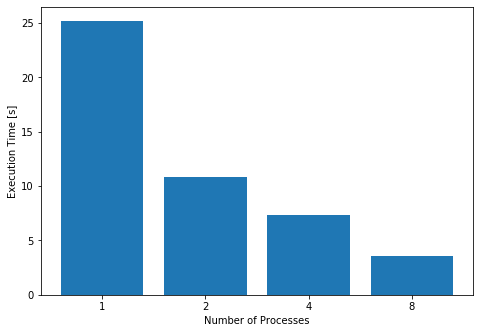

# Multiprocessing vs. Multithreading in Python (Part 1)

Python is often regarded as an easy programming language. Forget about labels and definitions, and, above all, brackets. It is a language that welcomes everyone, from the most experienced programmer to the younger newbie.

Well, that is, except if you are working with multiprocessing/multithreading.

The challenges of working with Python multiprocessing and multithreading begins with the fact that even the internet does not understand very well how it works. Indeed, I’ve found multiple wrong statements on stackoverflow responses (some with a high count of upvotes) and even very serious-looking blogs. Therefore, differently from other cases, where *programming* may also be called *stackoverflowing*, you better know at least the basics of what you are doing before starting to work with multiprocessing in Python.

Or else, you might have a bad time.


## The Basics

When looking for the difference between python multiprocessing and multithreading, one might have the impression that they work pretty much the same. That could not be more wrong. The key differences are:

*	A process is an independent instance executed in a processor core. Threads are components of a process and run concurrently (inside that process).
*	Processes do not share the same memory space, while threads do (their mother’s memory, poetic, right?).
*	Threads are lighter and cause less overhead. Also, because they share the same memory inside a process, it is easier, faster, and safer to share data.
*	True parallelism can ONLY be achieved using multiprocessing. That is because only one thread can be executed at a given time inside a process time-space. This is assured by Python’s global interpreter lock (GIL) (see [Python GIL at RealPython](https://realpython.com/python-gil/)).
*	Processes execution is scheduled by the operating system, while threads are scheduled by the GIL.

We should also understand the difference between concurrency and parallelism.
*	**Concurrent** execution means that two or more tasks are progressing at the same time.
*	**Parallel** execution implies that two or more jobs are being executed simultaneously.

Multithreading implements concurrency, multiprocessing implements parallelism. Processes run on separate processing nodes.


*Fig. 1: Processes run in parallel. Threads execute concurrently.*

## The Use Cases

So how do we decide between multiprocessing and multithreading?
The short answer is:
*	Multithreading for I/O intensive tasks and;
*	Multiprocessing for CPU intensive tasks (if you have multiple cores available)

But why?

### Multithreading: I/O bound tasks

Imagine you have a task that relies on the input from another part of the system, or from the user.

There is no reason to dedicate a process for that job because it would spend most of its time waiting for the stimuli to begin its work. It would be a waste of resources to dedicate a computing node for that, and it would bring no speedup whatsoever, given that the bottleneck is not on execution but on a third-party call. In this case, multithreading is the way to go.

Indeed, multithreading is usually implemented to handle GUIs. E.g., in a text editor program, one thread would be responsible for getting input from the keyboard, while another would check the spelling, and a third one could handle the formatting configurations.

I/O intensive programs can also directly benefit from multithreading because their bottlenecks are usually reading or writing operations (or downloads in the case of web scrappers, for example).Check the following example:

```python
def io_intensive(x):
    write_count = 50
    with urllib.request.urlopen(addrs[x], timeout=20) as conn:
        page = conn.read()
        for _ in range(write_count):
            with open('output.txt', 'w') as output:
                output.write(str(page))
```

This function loads some URL addresses into memory and writes them in a local text file (50 times, always overwriting the same file). That is pretty dumb, but its purpose is just to stress an I/O bound execution. You can check this code and execute it yourself in [this Notebook](https://github.com/gennsev/Python_MultiProc_Examples/blob/master/Example.ipynb).

Let us run that method over a list of 16 addresses and check their execution times for some different thread counts. That would get us the following graph (executing on a MacBook Air 2019).


Where the result for one thread stands for the serial execution of the code. We can see by the graphs that multithreading is capable of considerably reducing the algorithm's execution time. We could keep increasing the number of threads, but the gains would stop once we reach the point where each address is handled by a thread.

### Multiprocessing: CPU bound tasks

Now imagine you got a massive amount of data loaded in memory, and it all needs to be processed. Programs that are computing-bound will benefit from multiprocessing because their bottleneck is time and resources. Image and graphics processing are an excellent example of that. They consist of vast amounts of math operations, which can often be divided into separate tasks because their data is independent. GPUs are the state-of-the-art hardware in this regard, being designed to process large chunks of data in parallel.

To simulate computing-intensive algorithm, we will use the following code:

```python
def compute_intensive(x):
    foo = 0
    for i in range(10**7):
        foo += foo * math.cos(i*math.pi)
```

Again, you can check this code in [this notebook](https://github.com/gennsev/Python_MultiProc_Examples/blob/master/Example.ipynb) and execute it yourself (I ***strongly*** suggest you to take a look on that, as we have to make some workarounds to execute it properly on windows).

My MacBook features a dual-core processor with hyper-threading, so there is no use to force more than 4 processes running on it. Those are the results for the performance tests on this benchmark:


The multithreading provided no speedup (the execution times are virtually the same). However, we had a significant speedup when using multiprocessing. It was not enough to drop the execution time to one fourth of the original because of the time spent with process management. Remember that processes are much heavier than threads.


#### Multiprocessing on I/O intensive tasks
Even though this is not their best use case, there is no reason to expect multiprocessing to perform poorly on I/O intensive tasks. It is a waste of resources: imagine dedicating a processor core to a function that will, for a significant part of its execution, just wait for an input. A processor, even a cluster, only has so many processing nodes. We are better off dedicating them to real parallelism of applications that can only be accelerated by those means.

But for the sake of science, what would happen if we executed the first I/O-bound code using multiprocessing? The following graph shows it.



As expected, multiprocessing is also able to provide speedup on I/O bound computations. It is also noticeable that we kept the speedup even with 8 processes. The reason for that is processes start executing like threads in this case. The speedup is not coming from the parallelism, but from concurrency.

## Conclusions

* Use multithread for IO bound tasks.

* Use multiprocessing for CPU bound tasks. They can be used to handle I/O bound tasks as well, but it’s a bad idea.

The next part of this series will take a deeper look on how we can implement multiprocessing and multithreading in Python and how a Data Scientist can profit from them. There are many different ways to do it, and I encourage you to get some ideas from the documentation ([here](https://docs.python.org/3/library/concurrent.futures.html), [here](https://docs.python.org/3.8/library/threading.html), [and here](https://docs.python.org/3.8/library/multiprocessing.html)) and try them out on the examples model I provided at [this notebook](https://github.com/gennsev/Python_MultiProc_Examples/blob/master/Example.ipynb).
