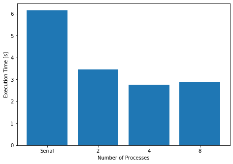

# Multithreading vs. Multiprocessing in Python (Part 2) - A Data Science Example

In the first part of this series we saw the differences between multiprocessing and multithreading in Python. Although we saw some examples there, I think it deserves some practical view on how it can be used on a real data science project.

In a very broad aspect, a data science project follows four steps:

1. Get the data;
2. Process the data;
3. Do something with the data;
4. Store other data

Naturally your project might follow somewhat different steps, but I’m sure you can follow this blog post to get some ideas.

> Remember the golden rule: `multithreading` for I/O bound tasks and `multiprocessing` for CPU bound task.

Now, it should not be hard to follow that the "get the data" and "store other data" steps are probably the ones where we should use `multithreading`. All the others ("process the data" and "do something with the data") are most probably better off using `multiprocessing`. You may argue that processing a lot of data might present an I/O bottleneck, and in some cases you might be right. If that is your case, you should try to break up this processing into "getting data" and "processing data" parts, so that the best strategy can be applied to each of them.

## Text Classification

Let's see how we can apply what we've learned in a classic Natural Language Processing (NLP) problem: text classification. The idea is to find out the category of a news article just by its text (e.g.: if it should be categorised as "sports", "finances", "economy", etc).

> If you are here only to see how multiprocessing and multithreading can be used in a real project, just follow along, you don't really need to know anything about NLP to understand this example. However, if you are interested by the subject, you should start by studying what [word vectors](https://en.wikipedia.org/wiki/Word_embedding) are. I like [this article](https://medium.com/@jayeshbahire/introduction-to-word-vectors-ea1d4e4b84bf). You can also follow [this GitHub repository](https://github.com/gennsev/tclass) where I and a colleague have been working on some text classification models (there are some cool notebooks there).

Our project is quite simple, we will:
1. Get some data from Reuters News Agency containing news and their respective labels (defining what type of news they are) ([Data source](https://www.cs.umb.edu/~smimarog/textmining/datasets/));
2. Vectorize them using `GloVe` pre-trained word vectors (trained from Wikipedia) ([GloVe project page](https://nlp.stanford.edu/projects/glove/));
3. Train a model using Random Forests with `scikit-learn` to classify texts under the given labels.

By now it shall be straightforward to see that step 1 can possibly be accelerated in Python using `multithreading`, while step 3 should use `multiprocessing`.

#### Loading Data
Let's start by the pre-trained GloVe word vectors loading. You can check the full code and execute it yourself in [this notebook](https://github.com/gennsev/Python_MultiProc_Examples/blob/master/Example-2.ipynb). Loading this pre-trained word vector file can take a lot of time. The file is considerably long, and we have to process it line per line. Each line contains a word and then a list of values for each dimension of its word vector.


```python
train = pd.read_csv('data/r8-train-all-terms.txt', header=None, sep='\t')
test = pd.read_csv('data/r8-test-all-terms.txt', header=None, sep='\t')
train.columns = ['label', 'content']
test.columns = ['label', 'content']

vectorizer = GloveVectorizer()
Xtrain = vectorizer.transform(train.content)
Ytrain = train.label
Xtest = vectorizer.transform(test.content)
Ytest = test.label
```
The `GloveVectorizer()` loads the pre-trained vectors in its `__init__` function, and can do it both asynchronously or serially.
This is how it performs the basic line-per-line file reading:
```python
with zipfile.ZipFile('data/glove.6B.50d.txt.zip') as zf:
  with io.TextIOWrapper(zf.open('glove.6B.50d.txt'), encoding='utf-8', errors='ignore') as f:
    for line in f:
      values = line.split()
      word = values[0]
      vec = np.asarray(values[1:], dtype='float32')
      wordVec_dict[word] = vec
      embedding.append(vec)
      idx2word.append(word)
```
And here is the `multithread` implementation:
```python
def process_vector(line, wordVec_dict, embedding, idx2word):
    values = line.split()
    word = values[0]
    vec = np.asarray(values[1:], dtype='float32')
    wordVec_dict[word] = vec
    embedding.append(vec)
    idx2word.append(word)

executor = ThreadPoolExecutor(max_workers=workers)
futures = []
with zipfile.ZipFile('data/glove.6B.50d.txt.zip') as zf:
  with io.TextIOWrapper(zf.open('glove.6B.50d.txt'), encoding='utf-8', errors='ignore') as f:
    for line in f:
      futures.append(executor.submit(process_vector, line, wordVec_dict, embedding, idx2word))
for future in as_completed(futures):
    pass
```
Again, I strongly recommend you to check how it was implemented in the [full code](https://github.com/gennsev/Python_MultiProc_Examples/blob/master/Example-2.ipynb).

The `ThreadPoolExecutor` runs its threads asynchronously. The last `for` loop is used to guarantee the execution will only keep going after all the threads submitted to the executor are finished. Check the [Python Documentation](https://docs.python.org/3/library/concurrent.futures.html#concurrent.futures.ThreadPoolExecutor) for more details on how `ThreadPoolExecutor` works.

But how faster does the vectors loading gets with `multithreading`? In my MacBook Air the first serial version loads the 400000 word vectors in around `269.19898986816406s`. The asynchronous approach loads the 400000 word vectors in `27.559515953063965s`, using 10 workers (it could probably reach the same execution time with even less workers, as the bottleneck is reading the lines, not processing).


#### Training the model
Now the cool part: training and testing.

Luckly for us, `scikit-learn` offers `multiprocessing` nativelly, just by setting it up on the model's parameters. The two following code examples train a same model with the same data serially or using a set number of `jobs` (which are mapped to processes in `scikit-learn`).

```python
model = RandomForestClassifier(n_estimators=200)
model.fit(Xtrain, Ytrain)
```
Using multiprocessing in `scikit-learn` is as easy as setting the `n_jobs` model parameter. Here, we will set it to two:
```python
model = RandomForestClassifier(n_estimators=200, n_jobs=2)
model.fit(Xtrain, Ytrain)
```

It's so easy you may doubt it works. But it does.
The following bar graph shows the training time of this same model for different numbers of jobs:



Oh, and if you are curious, the model accuracy (`RandomForestClassifier.scoreTrain`) turns out not bad at all:
```
Train score: 0.9992707383773929
Test score: 0.9346733668341709
```

#### Conclusions
I think it covers the most important parts. This last example shows how Python multiprocessing and multithreading features can be used to accelerate real projects, and sometimes with little-to-none code modifications.
All that glitters is not gold, though. You will soon find out, when looking forward to more complex parallel and asynchronous executions in python that things can get quite messy.
